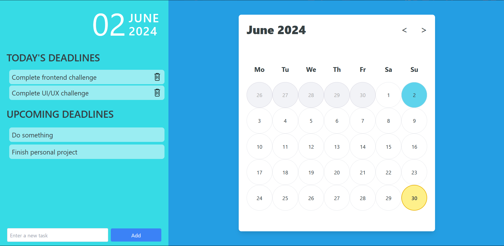

# CodeChef Challenge Week 1

## To Do List

Made a To Do list with a calendar

[Deployment Link](https://code-chef-weekly.vercel.app/)

## Preview

## Features

1. Today's date highlight
1. Pending task deadlines hightlight
1. Upcoming task display
1. Add and remove tasks interactively
1. Responsive design

## How to run locally

1. Clone the repository onto your local system
1. Run `npm install`
1. Run `npm run dev`
